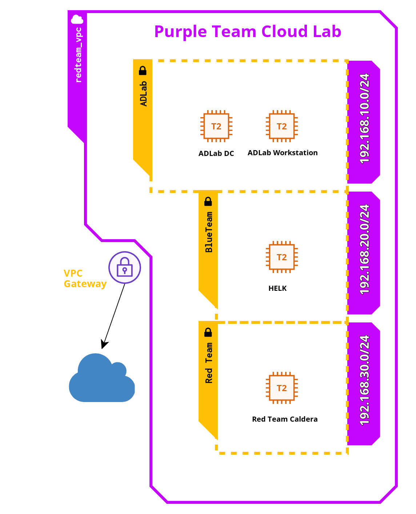

# Overview
Purple Team Cloud Lab is a cloud-based AD lab created to help you test real attacks in a controlled environment and create detection rules for them. It was originally created for MalTrak training: "In-depth Investigation & Threat Hunting" and now we decided to make it open-source and available for everyone.

This lab is build on AWS and it includes an active directory domain consists of a DC and a workstation both are Windows Server 2019 with sysmon and winlogbeat installed. Winlogbeat transfers these logs to the blueteam network that includes Threat Hunting ELK (HELK) to monitor the events happening in the domain and help you investigate the attacks and write the detection rules for them.

As well, you have a red team network with Caldera installed to simulate red teaming activites and different MITRE ATT&CK techniques. Alternatively, you have Atomic Red Team installed on both the domain machines so you can simulate different techniques with their atomics instead.

The blue team machine allows you to investigate the attack further using Kansa, Kape or through custom powershell scripts to collect volatile and non-volatile data and investigate them. This machine has Powershell remoting installed by default to connect to the AD network (using Negotiate/NTLM authentication).

# Design


## Machines
* **Red Team Caldera**: This machine is Amazon Linux 2 (Redhat based) with size t2.micro (no cost with AWS Free tier)
* **Blue Team HELK**: this machine is also Amazon Linux 2 with size t2.large (8 GB, 2 vcpu) and 30 GB of disk space 
* **ADLAB Machines**: Both the DC and Workstation are Windows Server 2019 with size t2.micro (no cost with AWS Free tier)

# Installation

## Prerequisites:

To install this cloud lab, you will need to have:

* An AWS Account 
* Windows as a host machine or run the lab in a windows VM (as we run a powershell script to configure the ADLAB machines)
* AWS Cli installed
* Terraform is copied to any folder in %PATH% Environment

## Installation

To install, you will need to follow these steps:

* Go to your AWS Account and create a user with administrator permissions and get its ACCESS KEY and SECRET KEY
* run ```aws configure``` in your command prompt (cmd) and provide the ACCESS KEY, SECRET KEY, the region as eu-west-1
* Switch to eu-west-1 region in your aws console (on the browser)
* Go to EC2 --> Instances --> Key Pair and create a key with name ```ec2_key_pair``` all lowercase and save the .pem key file
* Copy your ```ec2_key_pair.pem``` file to your ```C:\Users\<your username>\.ssh``` folder and rename it to ```id_rsa```
* Open cmd again, go to the purple lab directory (this project folder) and run ```terraform init``` and then ```terraform apply``` and say "yes"
* It will take ~ 40 mins to complete.

And Voila! you have your Purple team lab created in AWS. Just a reminder, keeping it running will cost you money.

If you want to change the region, you can update the main.tf file and change the region from there. Don't forget to create an ec2_key_pair in the region you choose as they are not transferrable between regions.

To destroy, run ```terraform destroy --auto-approve```

## Credentials

**To access the domain, you can use these credentials**
* **Administrator, Pass:LabPass1**: this is the local admin account, you can use it remotely with RDP or powershell remoting
* **adlab\ddean, Pass:LabPass1**: This is the domain admin account, you can use it to access both machines as a domain admin
* **adlab\kbaehr, Pass:LabPass1**: This is the workstation user, it doesn't have admin privileges (Possible privilege escalation?). Feel free to add him to the local admin group if you want to test UAC bypasses

**To access the blue team machine HELK**
* **SSH**: you can connect using ssh ```ec2-user@<blueteam public ip>``` and it will use your key pair you moved to .ssh folder and renamed to id_rsa
* **From the browser**: use the machine public IP and connect to it using https from your browser with credentials: **helk/LabPass1**

**To access the red team caldera machine**
* **SSH**: you can connect using ssh ```ec2-user@<redteam public ip>``` 
* **From the browser**: connect using HTTP to port 8888. The credentials are red/LabPass1 or blue/LabPass1.

# Capabilities:

## ADLAB Domain
The ADLAB domain is a very simple domains. It includes the DC which works as a domain controller and a DNS server. The domain has 3 users. And it has these tools installed:

* Sysmon and winlogbeat for Log Analysis
* Powershell remoting installed and configured to use (with self-signed certificates)
* Atomic Red Team installed (for red team simulations)
* Wireshark installed using chocolatey
* Chrome installed as well.

The whole domain is created using Powershell scripts which makes the creation highly customizable and a good learning material. Feel free to read, modify and update ```Setup-AD.ps1``` and ```Setup-Workstation.ps1``` scripts. 

Also feel free to add additional machines and users and execute ```Setup-Workstaion.ps1``` or a modified version of it for each additional machine you add to the AD

I decided to not use Ansible in this project to make it a good learning material for you. But definitely with Ansible, it will be much easier to develop.

## Blue Team HELK Machine
This machine is created not just for log analysis but also for more in-depth investigation. It includes:

* **Threat Hunting ELK**: Which has elasticsearch, kibana, logstash and elastialert. All running as docker images and they receive all the sysmon and the other logs using winlogbeat. 
* **Sigma Rules**: Sigma is useful in creating new alerts or new detections, you can compile them for elastialert. Please follow HELK documentation for how to do that.
* **Powershell Remoting**: Powershell remoting installation is quite tricky to work on Linux but it's here and it's working like a charm. It's very useful to connect directly to ADLAB domain and perform some actions as a blue teamer to investigate attacks or transfer files to the ADLAB domain.
* **Kansa & Kape**: Both these tools are known for DFIR and remote triage. Kansa.ps1 won't work properly on Linux but you can execute its modules directly on the AD machines using powershell remoting
* **Volatility**: volatility is a known tool for memory forensics and here we have volatility and volatility3 (with its symbols) installed by default with all their additional modules
* **Dumpit**: Dumpit is a known tool to create a memory dump on windows machine, it's included inside ```tools``` folder, transfer it to the AD machines using Powershell remoting and collect the memory dump back
* **Python2 and Python3**: We have both python2 & 3 installed, just be careful when you are using python or pip

**To use powershell remoting:**

This script will connect to ADLAB Domain controller, feel free to update it to connect to the workstation or to use another user.
```
$DefaultPassword = "LabPass1"
$IPAddr = "192.168.10.100"
$securePassword = ConvertTo-SecureString -AsPlainText -Force $DefaultPassword
$ddean = New-Object System.Management.Automation.PSCredential "adlab\ddean", $securePassword
Enter-PSSession -ComputerName $IPAddr -Authentication Negotiate -Credential $ddean
```

## Red Team Caldera
This machine has Caldera installed. Using caldera, you can drop a backdoor into your ADLAB machines and use it to control the domain, execute powershell commands remotely and simulate over 800 MITRE ATT&CK techniques. Caldera has up to 4 different types of backdoors and it's built by MITRE organization itself.

# Use Cases
* Simulating different attacks and see what type of footprint they leave on the logs or on the system
* Test different attack techniques and develop detections for them
* Customize the ADLAB environment to simulate your organization environment, test different attack techiques and look for gaps in your organization logs and your detections (Purple teaming)
* EDR Testing lab
* Product Security Lab
* Enterprise Active Directory lab with domain joined devices
* Malware / reverse engineering to study artifacts against domain joined devices
* SIEM / Threat Hunting / DFIR / Live Response lab with HELK

# Learn More

Feel free to reach out to us through [https://maltrak.com](https://maltrak.com)

## Follow us at:
* Youtube: [https://www.youtube.com/c/AmrThabet](https://www.youtube.com/c/AmrThabet)
* Linkedin: [https://www.linkedin.com/company/maltrak](https://www.linkedin.com/company/maltrak)
* Twitter: [https://twitter.com/Amr_Thabet](https://twitter.com/Amr_Thabet)
* Facebook: [https://www.facebook.com/MaltrakTraining](https://www.facebook.com/MaltrakTraining)
* Blog: [https://medium.com/maltrak](https://medium.com/maltrak)
* Website: [https://maltrak.com](https://maltrak.com)
